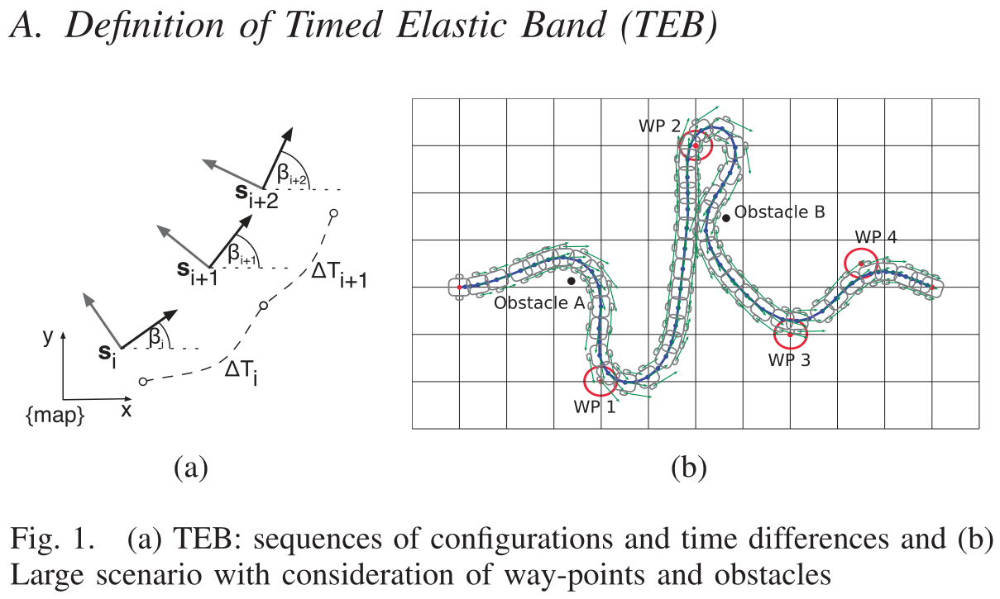
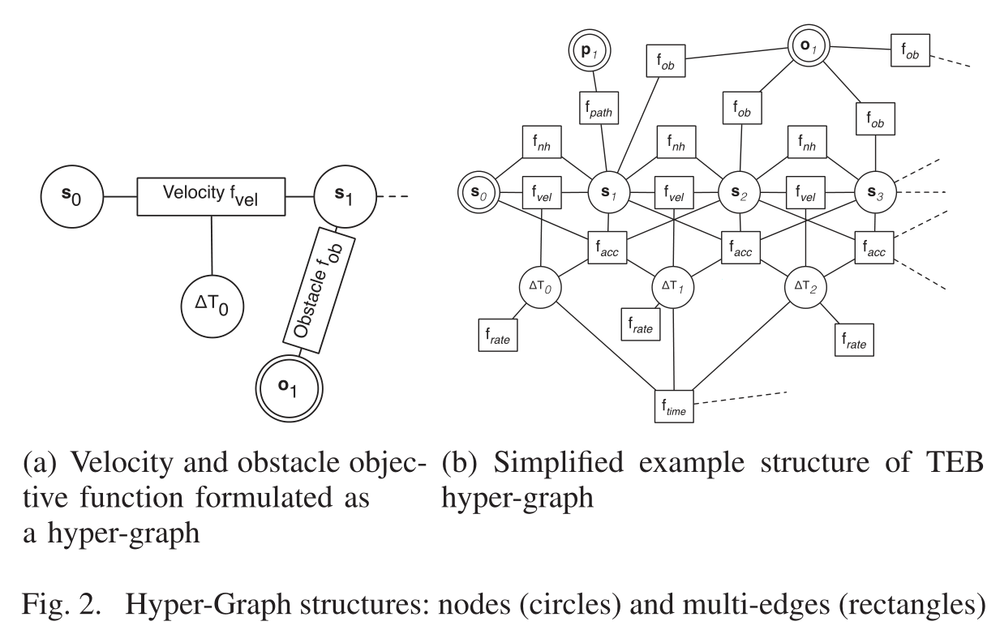
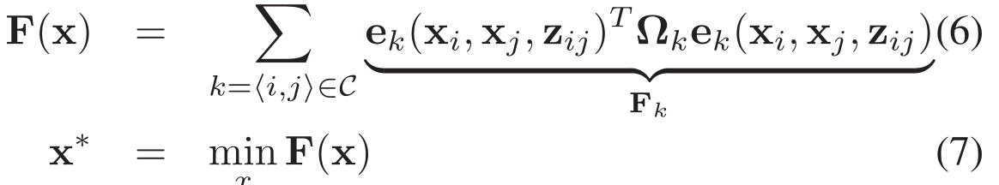

# Efficient Trajectory Optimization using a Sparse Model

# 基于稀疏模型的高效轨迹优化

## 摘要：

"timed elastic band"方法通过对全局规划器生成的初始轨迹进行后续修改来优化机器人轨迹。在轨迹优化中考虑的目标包括但不限于**总体路径长度**、**轨迹执行时间**、**和障碍物的距离**、**通过中间路径点**以及**遵循机器人的动力学、运动学**和**几何约束**。"时间弹性带"明确考虑运动的时空方面的动态约束，如有限的机器人速度和加速度。轨迹规划是实时进行的，这样"时间弹性带"就能应对动态障碍物和运动约束。将“时间弹性带”表述为标量化的**多目标优化问题**。大多数目标都是都是局部的，只与一小部分参数相关，因为它们只依赖于几个连续的机器人状态。这种局部结构导致了一个**稀疏的系统矩阵**，这允许利用快速和有效的优化技术，如开源框架“g2o”来解决“时间弹性带”问题。**“g2o"稀疏系统求解器**已成功地应用于VSLAM问题。本文描述了g2o框架在使用”定时弹性带“修正轨迹地背景下地应用和适应性。仿真和实际机器人实验结果表明，该方法具有良好地鲁棒性和计算效率。

## 1.介绍

轨迹规划是在满足机器人运动学和动态运动约束的前提下，找到最优的无碰撞轨迹。这篇文章主要研究假设全局规划器预先生成初始可行路径的轨迹修正问题[1]。特别是在服务机器人的场景中，对预先规划路径的动态修改比离线轨迹规划更可取。通过整合最新的传感器数据来处理动态环境的变化在线修正，从而对轨迹进行局部细化。在大多数现实的应用中，由于局部的、不完整的地图和动态障碍，环境模型会不断变化，此外，在实时应用中，大规模全局路径的（重新）计算通常是不可行的。这个观察结果导致了局部修改路径的方法，例如[2]，[3]提出的"时间弹性带"。

后来，该方法被推广到非完整运动学[4],[5],[6]和多自由度机器人系统[7]。[8]提出了一种方法，其初始路径是使用了优化技术的变型。轨迹的沿着路径的速度没有得到优化。随着优化的进行，时间参数用于控制路径的修正。规划器考虑非完整约束。

[9]处理轨迹的变形而不是路径通过明确考虑时间信息。步骤分解为利用排斥力的避障和连接维护。基于这项工作，[10]提出了一个单一步骤的方法，结合外部变形和内部连接力。这两种方法都支持一般的状态转换模型，并允许时空避障。相反，我们的方法是基于一个图优化公式，工作原理和一般的优化求解器类似，时间最优性是一个明确的目标。其他直接优化轨迹的方法在[11],[12]中介绍了。在我们的例子中，参数化路径增加了速度特性，遵循机器人的动力学约束。这个方法从全局规划器找到的初始路径开始，并通过一个紧凑的基于样条曲线的路径模型来表示它，该模型在[13]中使用。该路径模型暴露了一组更高层次的参数给优化，该优化迭代地调整曲率连续路径的形状以减少目标函数，例如旅行时间。我们工作地主要不同之处在于，将解析模型地精度转换成了离散化的轨迹模型，这使得它可以采用高度复杂、高效的优化算法，实现实时的轨迹细化。

大多数最近的轨迹修正方法处理多自由度的机器人手臂，使用位形空间中轨迹的离散表示(见[15],[16]).所提出的目标函数包含一个有限差分矩阵，以平滑所得到的轨迹，并另外满足避障等约束。CHOMP算法依赖于协变梯度下降法，该方法明确需要每个目标的梯度，而STOMP算法使用随机轨迹优化技术，不需要明确的梯度知识。两种方法都通过定义特定的离散化和任务持续时间，以隐式的方法包含时间信息。与我们的方法的不同之处在第四节中详细说明。

在[17]中，作者引入了一种叫做“时间弹性带”的新方法，它明确地用时间信息增强了“弹性带”。考虑了机器人动力学约束和直接修改轨迹而不是路径。“时间弹性带”是一种标量化的多目标优化方法。底层优化问题的结构是稀疏的，因为大多数目标都是局部的，所以它们只依赖于几个连续的配置而不是整个轨迹。

数值数学为稀疏结构的优化问题提供了有效的算法，这些算法已经成功的应用在例如“视觉同步定位和建图”(vSLAM)或“稀疏束调整”(SBA)问题中。[19]介绍了一种叫做“general(hyper-) graph optimization"(**g2o**) 的开源C++框架，它用于解决**基于图的非线性优化问题**。使用多目标优化框架的一个明显优点是目标和约束的模块化表达。

这篇文章提出的”时间弹性带“方法使用了基于非线性优化问题的super-graph，并在差分驱动的移动机器人上使用g2o进行了实现。该机器人在具有三个全局自由度和两个局部自由度的平面环境中运动。一般情况下，TEB也适用于高维状态空间。**通过考虑时间信息，TEB明确地考虑和控制机器人地速度和加速度**。

我们首先详细介绍了在文献[17]中描述地TEB的一般概念，特别是把问题映射到hyper-graph表示，确定TEB的初始条件和算法实现。章节3部分介绍了”时间弹性带“和g2o框架的关系。章节4介绍并分析实验结果。尽管本报告的实验描述的是非完整机器人，但该方法并不局限任何特定的机器人运动学或动力学结构。最后，章节5总结了TEB的结果并提供了未来工作的展望。

## 2.Timed Elastic Band

### A.TEB定义

图1. (a) TEB: 配置序列和时间差   (b): 考虑通过点和障碍物的大场景

经典的”弹性带“被描述为一系列n个中间机器人位姿:
$$
s_i=[x_i, y_i,\beta_i]^T \quad \epsilon \quad R^2 \times S^1
$$
如图1所示，在全局坐标系{map}的机器人配置包括
$$
位置x_i, y_i,方向\beta_i \\
Q=s_i,i=0...n,n \epsilon N  \quad\quad(1)
$$
TEB通过合并两个连续配置之间的时间间隔来增强这种表示，导致n-1个时间间隔delta_T_i :
$$
\tau=\Delta T_i,i=0...n-1 \quad (2)
$$
每个时间间隔表示机器人在图1中的序列Q从当前配置到下个配置的转换所需要的时间。TEB被定义为包含两个序列的元组：  
$$
B\quad := \quad (Q,\tau) \quad \quad (3)
$$
关键问题是利用加权模型，通过标量化多目标优化red，从配置和时差两方面对TEB进行适应和优化： 
$$
f(B)=\sum \gamma_kf_k(B) \quad (4) \\
B^*=arg \min f(B) \quad (5)
$$
其中B*表示最优的TEB，f(B)表示底层的全局目标函数。

[17]描述了适用于TEB的组件目标函数f_k，并属于两种基本类型：如速度和加速度限制的约束，根据与轨迹相关的惩罚函数和目标函数制定，例如最短路径、最快执行时间或和障碍物之间的间隙。稀疏约束优化算法并不容易在机器人框架(如ROS)中自由使用实现。这推动了g2o框架的使用，在该框架中，约束被制定为目标，通过分段连续、可微的成本函数来惩罚违反约束的行为。

### B.用Hyper-Graph表示问题

根据公式(4)，(5)，将TEB定义为标量化多目标优化问题。大多数所需的目标函数依赖于参数，而这些参数仅依赖于皮筋相邻配置的一个子集。

- 速度(加速度)约束取决于2个(3个)连续配置和1个(2个)时间差。
- 障碍物的间隙和中间路径点追踪，会影响单个配置及其k个最近的邻居(实际上约为3-5)。
- 机器人的非完整约束涉及到两个相邻的配置，这两个配置需要位于一个常曲率的共同的圆弧上。

最快和最短路径是局部结构的例外，因为这些全局目标依赖于所有参数。具有时间均匀间隔配置的最快路径是通过最小化所有时间差之和的平方或时间差的平方和来获得的。

TEB的局部性的这一性质导致了一个用hyper-graph表示的稀疏系统矩阵，其中的节点对应于配置和时间间隔。包含对同一目标函数有贡献的参数的节点由相应的多个边连接，下面将公式(4)转换为hyper-graph。hyper-graph的定义意味着单个边连接的节点数量并不想传统graph中那样仅限于两个节点。hyper-edge是传统边的延伸，因为它连接了多个节点。每个目标函数依赖于一个TEB状态子集(配置和时间间隔), hyper-edge表示目标函数f_k，并连接与配置和时间间隔对应的节点，这些节点作为评估参数出现。

(a) 速度和障碍物目标函数表示为一个hyper-graph         (b) TEB hyper-graph的简化示例结构

图2. Hyper-Graph结构：节点(圆圈)、multi-edges(矩形)

图2展示了一个hyper-graph的简单示例，它表示了与两个后续配置s0、s1、和它们的时间间隔delta_t_0、障碍o1属于R^2相关的约束和目标。注意，我们的特定实现将每一个配置节点划分为位置节点和方向节点，以让目标函数的模块化激活和取消激活更容易。速度目标函数为s0和s1的距离设置了上限，使机器人能够在分配的时间delta_T_0内行进。Velocity-muliti-edges(f_vel)和acceleration-multi-edges(f_acc)捕获动态方面。障碍物和它们的最近配置之间的距离(例子中的o1和s1)通过最小的分隔约束来保证无碰撞路径。障碍物的位置是由机器人结构中的感知层提供的传感器数据推断出来的。对应的障碍物不受图优化的影响，如图2(a)中的双圆表示。图2(b)显示了与大多数实施的目标函数相关TEB hyper-graph的较大摘录。将每条multi-edge的目标函数按其权重表示到总体目标函数中。除了固定的障碍物节点外，路径点配置p和初始状态s0也是固定的。在我们的应用中，我们在控制回路中使用规划器，因此初始状态由机器人的当前配置给出。

### C.控制流

图3展示了TEB实现的控制流。在初始化阶段，将初始路径通过根据动态和运动学约束添加默认时间信息来增强为初始轨迹。在我们的例子中，初始轨迹由具有纯旋转和平移的分段线段组成。这种以多边形表示的路径通常由概率路线图规划器提供[22]。

在每个轨迹修改步骤，算法动态地增加或删除配置，以调整剩余轨迹长度和规划范围地空间和时间分辨率。机器人对障碍物和路径点地最新感知结果和TEB状态相关。注意，通过找到TEB和障碍物预测之间地最小时空距离（而不是使用实际地姿态测量）结合障碍物运动模型（例如匀速）通常会产生更直观地解决方案。为了挑战我们的规划器并分析如何实时应对感知的障碍物，我们在章节4中的实验把障碍物当作静态的。我们处理动态障碍物的扩展方法是直截了当的。优化问题被转化为hyper-graph，并通过在下一节中详细描述的g2o框架求解。g2o框架以批处理方式优化TEB，因此每次迭代都会生成一个新的图，并使用最近的求解结果进行初始化。我们建议在单个机器人控制周期内执行多个轨迹修正步骤迭代（比如四个循环，每循环5个Levenberg-Marquardt迭代）。

验证优化后的TEB是否违反了硬约束，在这种情况下，机器人要么停止，要么重新调用运动规划器。成功验证后，根据TEB中的下一个配置计算控制变量v和w，并将其作为运动命令发送到机器人。在每次修改之前，重新初始化阶段检查新的或修改的路径点是有用的，如果路径点不是来自静态地图，而是被认为是一个机器人上的相机或激光雷达。

## 3.G2o Graph Optimization

g2o已被开发用于解决非线性优化问题，具有以下特定结构[19]：

x表示要优化的参数，z_ij表示两个参数块之间的约束，x_i和x_j和omega_k表示约束的信息矩阵。

## 参考文献：

[1] S. M. LaV alle, ”Planning Algorithms”. Cambridge University Press,Cambridge, U.K., 2006.

[2] S. Quinlan, O. Khatib, ”Elastic Bands: Connecting Path Planning and Control”, in Proc. of the IEEE Int. Conf. on Robotics and Automation (ICRA), pp. 802-807, 1993.

[3] S. Quinlan, ”Real-time modification of collision-free paths”, PhD thesis, Stanford University, 1994.
[4] M. Khatib, ”Sensor-based motion control for mobile robots”, Labora- toire d’Automatique et d’Analyse des Systèmes LAAS-CNRS, 1996.
[5] M. Khatib, H. Jaouni, R. Chatila, J. P. Laumond, ”Dynamic Path Modification for Car-Like Nonholonomic Mobile Robots”, in Proc.
of the IEEE Int. Conf. on Robotics and Automation (ICRA), 1997.
[6] B. Graf, J. M. H. Wandosell, C. Schaeffer, ”Flexible Path Planning for Nonholonomic Mobile Robots”, Fraunhofer Institute Manufacturing Engineering and Automation (IPA), 2001.
[7] O. Brock, O. Khatib, ”Executing Motion Plans for Robots with Many Degrees of Freedom in Dynamic Environments”, in Proc. of the IEEE Int. Conf. on Robotics and Automation (ICRA), pp. 1-6, 1998.
[8] F. Lamiraux, D. Bonnafous, O. Lefebvre, ”Reactive path deformation for nonholonomic mobile robots”, in IEEE Transactions on Robotics, Vol. 20, No. 6, pp. 967-977, 2004.
[9] H. Kurniawati, T. Fraichard, ”From path to trajectory deformation”, IEEE/RSJ Intl. Conference on Intelligent Robots and Systems (IROS), pp. 159-164, 2007.
[10] V. Delsart, T. Fraichard, ”Reactive Trajectory Deformation to Navigate Dynamic Environments”, in Proc. of the Second European Robotics Symposium (EUROS), Vol. 44, pp. 233-241, 2008.
[11] B. Lau, C. Sprunk, W. Burgard, ”Kinodynamic Motion Planning for Mobile Robots Using Splines”, IEEE/RSJ Intl. Conference on
Intelligent Robots and Systems (IROS), pp. 2427-2433, 2009.
[12] C. Sprunk et al. ”Online Generation of Kinodynamic Trajectories for Non-Circular Omnidirectional Robots”, in Proc. of the IEEE Intl. Conference on Robotics and Automation (ICRA), pp. 72-77, 2011.
[13] C. Sprunk et al., ”Improved Non-linear Spline Fitting for Teaching Trajectories to Mobile Robots”, in Proc. of the IEEE Intl. Conference on Robotics and Automation (ICRA), pp. 2068-2073, 2012.
[14] J. Mattingley, Y. Wang, S. Boyd, ”Receding Horizon Control: Automatic Generation of High-Speed Solvers”, in IEEE Control Systems Magazine, Vol. 31, No. 3, pp. 52-65, 2011.
[15] N. Ratliff et al. ”CHOMP: Gradient Optimization Techniques for Efficient Motion Planning”, in IEEE Intl. Conference on Robotics and Automation (ICRA), May 2009.
[16] M. Kalakrishnan et al. ”STOMP: Stochastic trajectory optimization for motion planning”, in IEEE Intl. Conference on Robotics and Automation (ICRA), pp. 4569-4574, May 2011.
[17] C. Rösmann et al. ”Trajectory modification considering dynamic constraints of autonomous robots”, in Proceedings of the 7th German Conference on Robotics (ROBOTIK 2012). May 2012.
[18] K. Konolige, ”Sparse Bundle Adjustment”, in F. Labrosse et al.,editors, Proc. of the British Machine Vision Conference, pages 102.1-102.11. BMVA Press, September 2010.
[19] R. Kümmerle et al., ”g2o: A general framework for graph optimization”, in Proc. of the IEEE Intl. Conf. on Robotics and Automation (ICRA), Shanghai, China, May 2011.
[20] P. R. Amestoy, T. A. Davis, and I. S. Duff, ”Algorithm 837: Amd, an approximate minimum degree ordering algorithm.”, in ACM Trans. Math. Softw. vol. 30, pp. 381-388, September 2004.
[21] Y. Chen et al., ”Alogithm 887: Cholmod, supernodal sparse cholesky factorization and update/downdate”, in ACM Trans. Math. Softw. vol. 35, pp: 22:1-22:14, October 2008.
[22] L. E. Kavraki et al., ”Probabilistic roadmaps for path planning in high-dimensional configuration spaces”, in IEEE Transactions on Robotics and Automation, Vol. 12, No.4, pp.566-580, August 1996.