# Trajectory modification considering dynamic constraints of autonomous robots 2012

Christoph Rösmann, Wendelin Feiten, Thomas Wösch

## 摘要

经典的“弹性带”使全局规划器生成的路径相对于最短路径长度变形，同时避免接触障碍物。它不直接考虑底层机器人的任何动态约束。本文提出了一种名为“时间弹性带”的新方法，该方法根据动态约束（如限制速度和加速度的机器人）明确考虑了运动的时间方面。在加权多目标优化框架下，提出了“时间弹性带”问题。大多数目标都是局部的，因为它们依赖于一些相邻的中间配置。这导致了一个稀疏系统矩阵，其中存在有效的大规模约束最小二乘优化方法。

仿真和实际机器人实验结果表明，该方法具有鲁棒性和计算效率，能够实时生成最优机器人轨迹。该“时间弹性带”将一系列路径点组成的初始路径转换为显示依赖于时间的轨迹，实现对机器人的实时控制。由于其模块化的提法，该方法很容易扩展，以纳入额外的目标和限制。

## 1.介绍

运动规划使在运动学和动力学约束下寻找无碰撞轨迹。

在运动规划的背景下，本文的重点是局部路径修改，假设初始路径已经由全局规划器生成[1]。特别是在服务机器人中，由于环境可能是动态变化的，因此由于动态环境固有的不确定性，路径的修改是一种较好的方法。此外，由于局部的、不完整的地图和动态障碍，环境模型可能会发生变化。此外，在实时应用中，大规模全局路径的（重新）计算通常是不可行的。这一观察结果导致了局部修改路径的方法，例如[2,3]提出的“弹性带”方法。“弹性带”方法的主要思想是将原来给定的路径视为一个弹性橡皮带，使其变形，该橡皮筋受内外力的平衡作用，试图在与障碍物保持一定距离的情况下收缩路径。

后来，这种方法被扩展到非完整运动学[4,5,6]，多自由度机器人系统[7]和动态障碍物[8]中。然而，据我们所知，动态运动约束还没有被认为是路径变形中的一个客观因素。典型的平滑路径的方法，例如使用样条曲线来获得动态可行的轨迹。

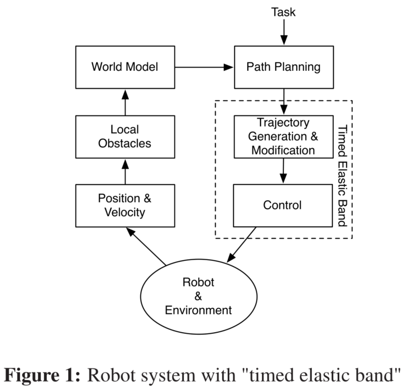

我们的方法是一种新颖的被称为“时间弹性带”的方法，因为它明确地增加了“弹性带”与时间信息，从而允许考虑机器人的动态约束和直接修改修改轨迹(而不仅是路径)。图1是带有“时间弹性带”的机器人系统架构。通过考虑时间信息，“时间弹性带”也可以用来控制机器人的速度和加速度。这个新方法也适用于高维状态空间，即使本文考虑在具有三个全局自由度和两个局部自由度的平面环境中移动的差分驱动移动机器人。

## 2.时间弹性带

经典的“弹性带”是用n个中间机器人姿态$X_i=(x_i,y_i,\beta_i)^T \quad \epsilon \quad R^2 \times S^1$的序列来描述,下式中表示为机器人在相关坐标系({map},图2)中包含位置$x_i,y_i$和方向$\beta_i$.
$$
Q=\{x_i\},i=0...n,n\epsilon N \quad (1)
$$
"时间弹性带"(TEB)通过两个连续配置之间的时间间隔增加，导致一系列n-1时间差$\Delta T_i $:
$$
\tau=\{\Delta T_i\},i=0...n-1 \quad (2)
$$
每个时间差表示机器人从一个配置按照顺序过渡到下一个配置所需要的时间（图2）。TEB被定义为两个序列的元组：
$$
B:=(Q,\tau) \quad (3)
$$
关键思想是通过实时的加权多目标优化，对TEB的配置和时间间隔进行调整和优化：
$$
f(B)=\sum_{k}\gamma_kf_k(B) \quad (4) \\
B^*=argmin f(B) \quad (5)
$$
其中$B^*$是最优的TEB求解结果，$f(B)$​​是目标函数。在本文中，它是一个包含了各个方面分量的加权和。这是多目标优化最基本的方法，但它已经产生了很好的结果。在未来的工作中，可能会研究更复杂的方法。

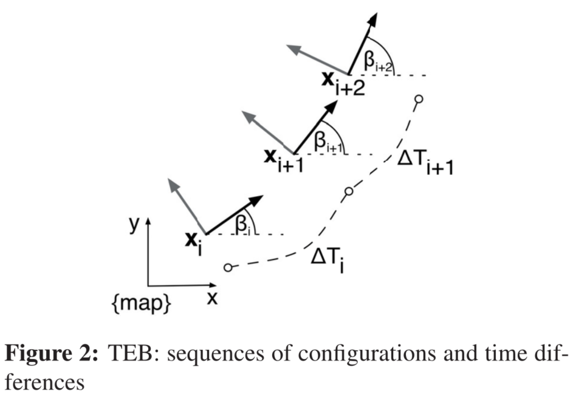

目标函数的大部分组件相对于B是局部的，因为它们仅取决于少数连续配置而不是整个弹性带。TEB局部性的这一性质导致了一个稀疏系统矩阵，为其提供了专门的快速有效的大规模数值优化方法。

TEB的目标函数有两种类型：约束，如速度和加速度限制，根据惩罚函数和目标制定，与轨迹（如最短或最快路径）有关(Eq.18)或和障碍物保持间隙(Eq.8)。稀疏约束优化算法并不容易在机器人框架(如ROS)中轻易实现。因此，在”时间弹性带“的背景下，这些约束被表述为一个目标，在一个连续的、可微的代价函数(Eq.6)中惩罚违反约束的行为。 
$$
e_{\Gamma}(x,x_r,\epsilon ,S,n) \simeq \begin{cases} (\frac{x-(x_r-\epsilon)}{S})^n \quad ,if  \quad x>x_r-\epsilon \\ 0,\quad otherwise\end{cases} \quad (6)
$$
$x_r$表示界限。

$S,n,和\epsilon$影响近似的准确性。特别是$S$表示缩放,$n$是多项式阶数，$ \epsilon$近似一个小的平移。

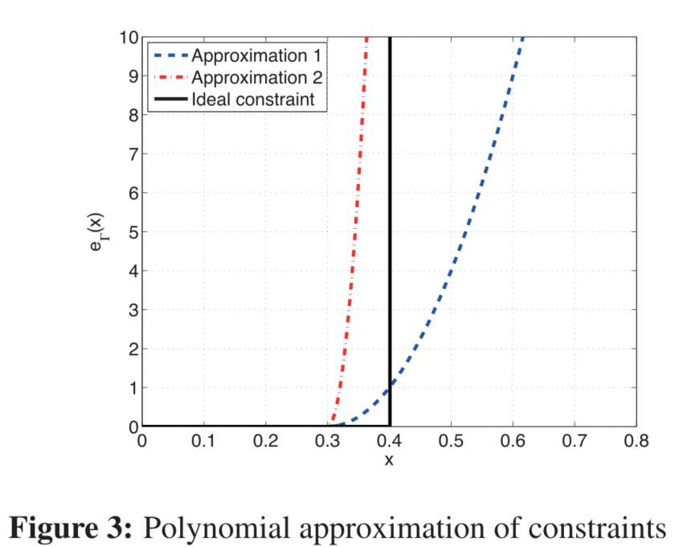

图3显示了方程6的两种不同的实现。Approximation 1的参数为$n=2$,$S=0.1$,$\epsilon=0.1$，Approximation 2的参数为$n=2$,$S=0.05$,$\epsilon=0.1$,更陡一些。这个例子显示了约束的逼近值$x_r=0.4$​。

使用多目标优化框架的一个明显优势是目标函数的模块化形式。目前在TEB中采用的目标函数如下：

### 2.1 Way points and obstacles

TEB同时考虑了原始路径中间路径点的到达和静态或动态障碍物的避免。这两个目标函数的不同之处在于路径点吸引弹性带而障碍物排斥它。目标函数依赖于弹性带与路径点或障碍物$z_j$之间的最小间隔$d_{min,j}$(图4)。对于路点，距离的上边界为最大目标半径$r_{p_{max}}$(Eq.7)，对于障碍物，距离的最小边界为最小的距离$r_{o_{min}}$​(Eq.8)。这些约束由式6的惩罚函数实现。
$$
f_{path}=e_{\Gamma}(d_{min,j},r_{p_{max}},\epsilon,S,n) \quad (7) \\
f_{ob}=e_{\Gamma}(-d_{min,j},-r_{o_{min}},\epsilon,S,n) \quad (8)
$$
根据图3，方程8中$d_{min,j}$和边界$r_{o_{min}}$的符号为负，是因为$e_{\Gamma}$​函数的定义的形式。

注意，这些目标函数的梯度可以解释为作用在橡皮筋上的外力。

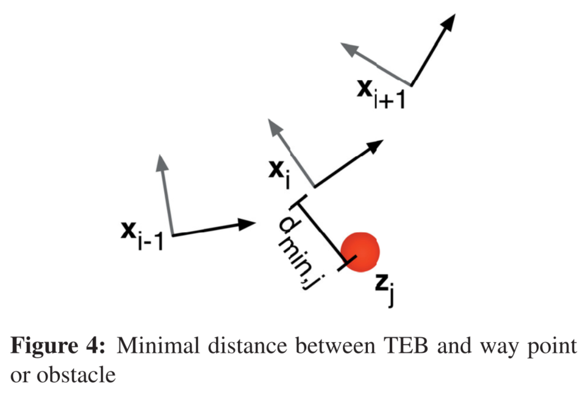

### 2.2 Velocity and acceleration

机器人速度和加速度的动态约束用和几何约束类似的惩罚函数来描述。图2显示了TEB的结构。平均平移速度和旋转速度是根据两个连续配置$X_i,X_{i+1}$之间的欧式距离或角距离以及两个姿态之间转换的时间间隔$\Delta T_i$​来计算的。
$$
v_i \simeq \frac{1}{\Delta T_i}|| \biggl( \begin{matrix} x_{i+1}-x_i \\y_{i+1}-y_i \end{matrix} \biggr) || \quad (9) \\
w_i \simeq \frac{\beta_{i+1}-\beta_i}{\Delta T_i} \quad (10)
$$

由于节点的临近性，欧式距离是两个连续姿态之间圆弧路径的真实长度的充分近似。加速度与两个连续的平均速度相关，因此考虑具有两个相应时间间隔的三个连续配置：
$$
a_i=\frac{2(v_{i+1}-v_i)}{\Delta T_i+\Delta T_{i+1}} \quad (11)
$$
为了清晰起见，在公式11中三个连续的构型被它们的两个相关的速度所取代。

> 可以理解为$v_{i+1}$和$v_i$是两段的各自平均速度，也就是两段路程的中点的速度，那么这两个速度点之间经过的时间为两段路程的时间的1/2.

旋转加速度的计算类似于公式11，考虑旋转速度而不是平移速度。考虑一个差分驱动的移动机器人，车轮速度与机器人中心点的平移和旋转速度$v_i$和$w_i$​之间的关系计算如下:
$$
v_{w_r,i}=v_i+Lw_i \quad (12) \\
v_{w_l,i}=v_i-Lw_i \quad (13)
$$
其中参数L表示机器人轴距的一半。

对公式12和公式13进行关于时间的微分，得到相应的车轮加速度。车轮速度和加速度根据制造商的规格限制上边界和下边界。机器人的平移和转动惯量可以以一种明确的方式包含在内，但在第一步实现中，我们还没有这么做。

### 2.3 Non-holonomic kinematics

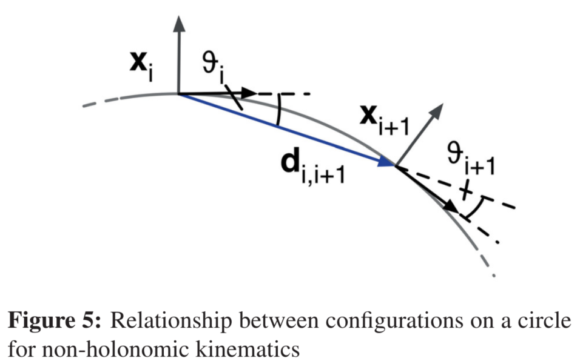

差分驱动机器人只有两个局部自由度。因此，它们只能在机器人当前的朝向上执行运动。这个运动约束导致一条由圆弧段组成的光滑路径。因此，两个相邻的构型需要位于如图5所示的常曲率的公共圆弧上：初始构型$X_i$和方向$d_{i,i+1}$之间的角度$\theta_i$必须等于终点构型$X_{i+1}$和方向$d_{i,i+1}$之间的角度$\theta_{i+1}$。如果$\beta_i$表示机器人在第i个构型的绝对方向，则弧形条件要求：
$$
\theta_i=\theta_{i+1} \quad (14) \\
\Rightarrow \Biggl( \begin{matrix} cos\beta_i \\ sin\beta_i \\0 \end{matrix} \Biggr) \times d_{i,i+1}=d_{i,i+1} \times \Biggl( \begin{matrix} cos\beta_{i+1} \\ sin\beta_{i+1} \\0 \end{matrix} \Biggr) \quad (15)
$$
其中，方向向量
$$
d_{i,i+1}:=\Biggl( \begin{matrix} x_{i+1}-x_i \\ y_{i+1}-y_i \\0 \end{matrix} \Biggr) \quad (16)
$$

> 我理解的是叉乘得到的是向量，(15)式中左右叉乘之后向量的方向是一致的，大小应该也是相同的吧。

对应的目标函数：
$$
f_k(x_i,x_{i+1})=\begin{Vmatrix} \left[ \Biggl( \begin{matrix} cos\beta_i \\ sin\beta_i \\0 \end{matrix}\Biggr)+ \Biggl( \begin{matrix} cos\beta_{i+1} \\ sin\beta_{i+1} \\0 \end{matrix} \Biggr)\right]\times d_{i,i+1}\end{Vmatrix}^2 \quad (17)
$$

> 向量A和B的叉乘的模为A和B两条边所形成的平行四边形的面积，所以（17）式可以解释为如果机器人做小圆周运动的话其目标函数值较大，若机器人做大圆周运动趋近于直线运动时其目标函数较小，可以理解为横摆角速度越小该目标函数越小。
>
> $||A \times B||=||A||*||B||*sin\theta$，$\theta$为向量A和B的夹角。
>
> 参考链接：[向量点乘与叉乘](https://blog.csdn.net/pangshaohua/article/details/87915950)

惩罚违反此约束的二次误差。一个潜在的180°方向变化由一个额外的方法处理。

### 2.4 Fastest path

以前的“弹性带”方法通过收缩弹性带的内力来获得最短路径。由于我们的方法将时间信息作为最短路径的目标，我们可以选择用最快路径的目标代替最短路径的目标，或者将这些目标结合起来。最快路径的目标很容易通过最小化所有时间间隔之和的平方来实现。
$$
f_k=(\sum_{i=1}^n\Delta T_i)^2 \quad (18)
$$
这个目标导致了一个最快的路径，在这个路径中，中间的构型在时间而不是空间上是一致分离的。

### 2.5 Implementation

图6展示了实现TEB的控制流。在初始化阶段，将初始路径增强为初始轨迹，并根据动力学和运动学约束添加缺省时间信息。在我们的例子中，初始轨迹是由纯旋转和平移的分段线段组成。这种以多边形表示的路径通常由概率路线图规划器提供[9]。或者，Reeds Shepp路径很容易增强为容许轨迹[10]。

在每次迭代中，算法动态地增加新的构型或删除以前的构型，以对剩余的轨迹长度和规划范围调整空间和时间分辨率。为了避免震荡，采用了迟滞。将优化问题转换为hyper-graph，并利用g2o框架[11]中包含的稀疏系统的大规模优化算法求解。

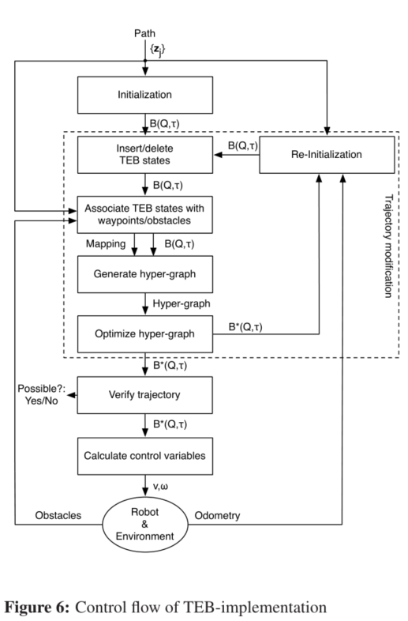

这个hyper-graph中的单个边连接节点的数量不受限制。因此一条边可以连接两个以上的节点。将TEB问题(Eq.4)转化为一个以**构型和时间间隔为节点的超图**。它们和表示给定目标函数$f_k$或约束函数的边相连。图7显示了一个具有两种构型、一个时间间隔、一个点形障碍物的示例的hyper-graph。速度边界目标函数需要平均速度，平均速度与两个构型的欧拉距离和所需的旅行时间有关。因此它形成了连接B的这些状态的边。障碍物需要有一条边连接到最近的构型上。表示障碍物的节点是固定的（双圆），因此优化算法无法改变其参数（位置）。

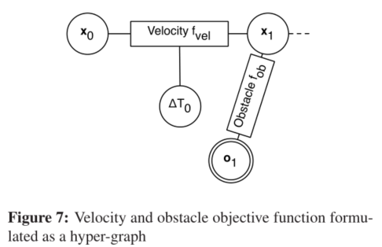

在验证优化后的TEB后，可以计算控制变量$v和w$​以直接给机器人驱动系统发送指令。在每一次新的迭代之前，重新初始化阶段会检查新的和不断变化的路径点，如果在分析短距离相机或激光扫描数据后接收到路径点，这会很有用。

## 3.实验结果

在本节中，我们对实验结果作一个简短的概述。

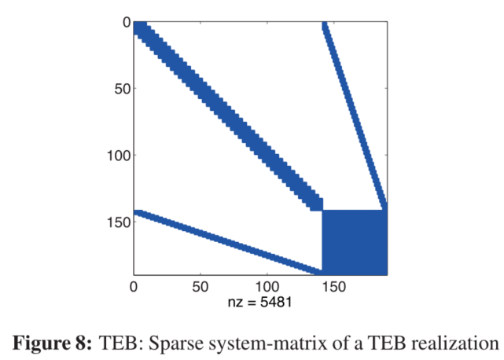

图8表明，最终的TEB系统矩阵仍然稀疏，有15%的非零元素。在此示例中，前141个状态对应于47个构型$X_i$，142-189是相对时间差$\Delta T_i$。这些最后的状态与目标函数有关，目标函数的目标是实现最快的轨迹，因此这块是密集的，并于TEB的维度成二次增加。

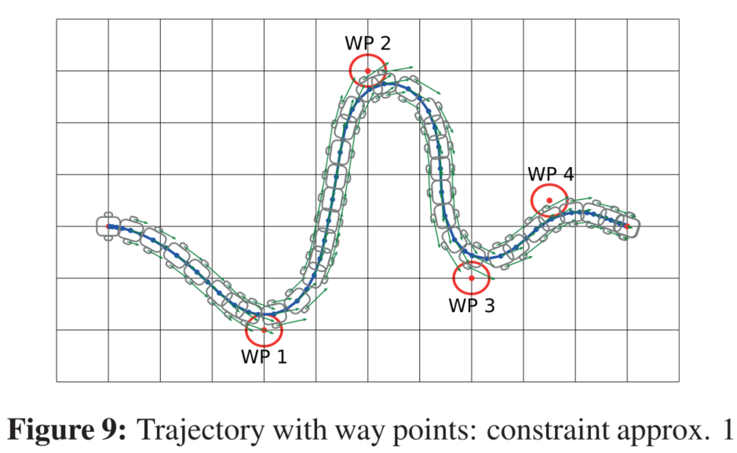

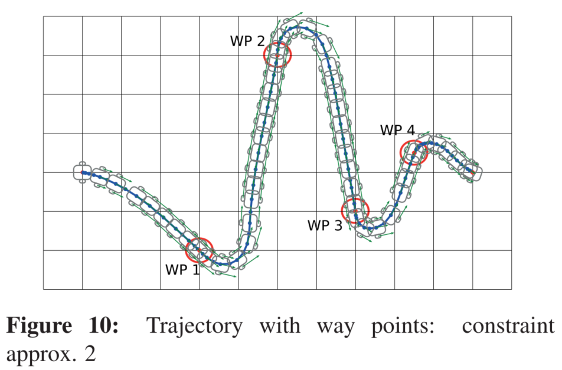

> approx.1的对路点偏离的惩罚没有那么陡，所以优化出的路径没有完全跨过路点。
>
> approx.2的对路点偏离的惩罚比较陡，所以优化出的路径比较紧密的贴着路点过去。

图9和图10显示了一个包含四个中间路径点的场景。在第二种情况下，根据图3（approx.2），TEB对违反几何约束的情况采用了更强的惩罚，从而使机器人更准确地穿越路径点。然而，采用较弱的约束惩罚的解决方案通常会导致更平滑的轨迹和更少的超调。根据具体的应用，调整权重允许在更精确或更光滑和更快的轨迹中调整重点。如图11中动态限制（$v_{max}=1.4m/s,\quad a_{max}=0.4m/s^2$​）被考虑进来。图12给出了一个避免静态障碍物的场景。

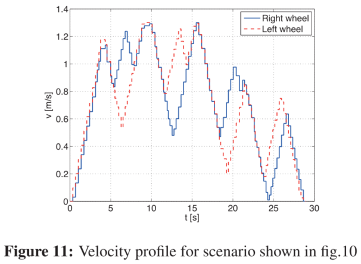

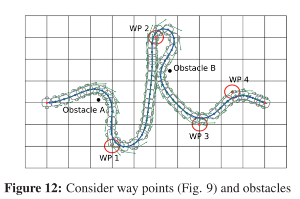

随着时间信息的增加，弹性带的增加以及高效的大规模优化器的可用性使得机器人的实时轨迹适应和控制成为可能。

图13显示了用Pioneer2机器人进行的实验的一系列快照，其中有一个人在场景中行走。Pioneer2是由西门子Lifebook s6410(Core2Duo, 2.4GHz, 2GBRAM)控制，并配备Hokuyo激光扫描器以检测障碍物位置的动态变化。TEB实时调整原始机器人轨迹(t=0)，并通过将轨迹拉伸远离障碍物来避免在时间间隔$t\in [6,12]$内与人即将发生碰撞。控制周期时间为25ms。

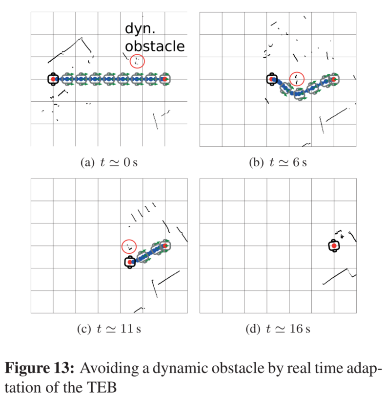

## 4.结论和未来工作

本文提出了一种基于时间弹性带的轨迹实时修正方法。它以时间信息对经典“弹性带”理论的扩充为基础。该方法不仅可以考虑路径上的几何约束，而且可以同时考虑移动机器人的动力学约束。该算法是实时操作的，因此可以直接为底层机器人运动控制器生成指令。该方法灵活性高，易于适应不同的机器人运动学和应用要求。

未来的工作是开发一个稀疏约束优化框架，从而使当前根据惩罚函数制定的约束条件过时。另一个研究方法是使弹性带“越障”。从技术上讲，该方法是用与最近点的轨迹相反方向的弹性带围绕障碍物，将它们粘在切点处并在该点切割所得轨迹以获得穿过另一侧障碍物的轨迹。优化完这条轨迹后，决定在障碍物的哪一边基于。注意，这仍然是一个局部优化，不能保证找到全局最优值。

## 参考文献：

[1] S. M. LaV alle.Planning Algorithms, Cambridge University Press, Cambridge, U.K., 2006.
[2] Quinlan, S.; Khatib, O.Elastic Bands: Connecting Path Planning and Control, IEEE Int. Conf. on Robotics and Automation (ICRA) (2), 1993
[3] Quinlan, S.Real-time modification of collision-free paths, PhD thesis, Stanford University, 1994
[4] Khatib, M.Sensor-based motion control for mobile robots, Laboratoire d’Automatique et d’Analyse des Systèmes LAAS-CNRS, 1996
[5] Khatib, M. et al.Dynamic Path Modification for Car-Like Nonholonomic Mobile Robots, IEEE Int. Conf. on Robotics and Automation (ICRA), 1997
[6] Graf, B.; Wandosell, J.M.H.; Schaeffer, C.Flexible Path Planning for Nonholonomic Mobile Robots, Fraunhofer Institute Manufacturing Engineering and Automation (IPA), 2001
[7] Brock, O.; Khatib, O.Executing Motion Plans for Robots with Many Degrees of Freedom in Dynamic Environments, IEEE Int. Conf. on Robotics and Automation (ICRA), 1998, pp. 1-6
[8] Fiorini, P .; Shiller, Z.Motion planning in dynamic environments using velocity obstacles, International Journal on Robotics Research, V ol. 17, No. 7, July 1998, pp. 760-772
[9] Kavraki, L.E. et al.Probabilistic roadmaps for path planning in high-dimensional configuration spaces, IEEE Transactions on Robotics and Automation, V ol. 12, No.4, August 1996, pp.566-580
[10] Reeds, J.A.; Shepp L.A.Optimal paths for a car that goes both forwards and backwards, Pacific Journal of Mathematics, Vol. 145, No. 2, 1990, pp. 367-393
[11] Kümmerle, R. et al.g2o: A General Framework for Graph Optimization, Proc. of the IEEE Int. Conf. on Robotics and Automation (ICRA), May 2011